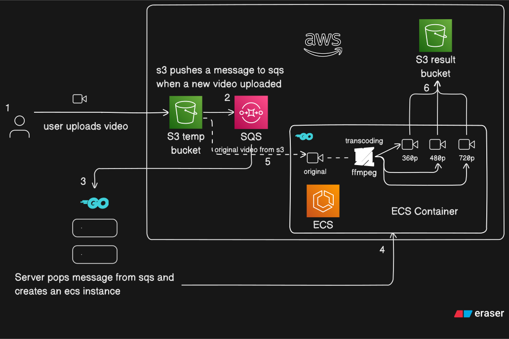
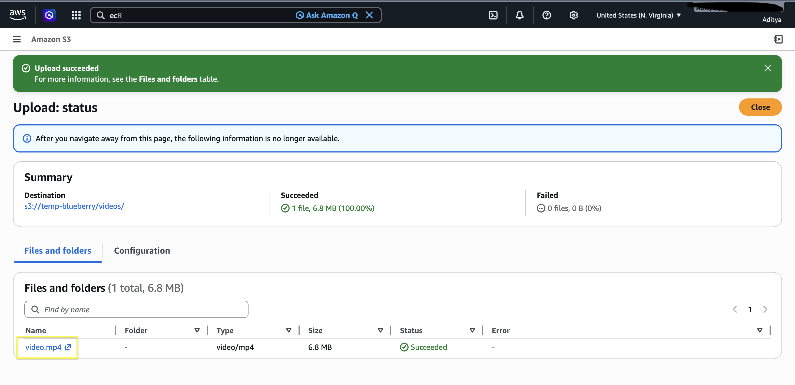
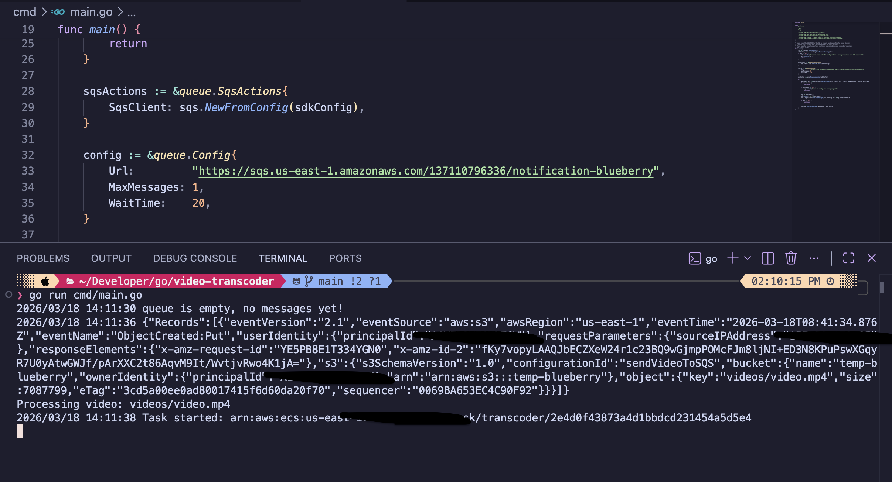
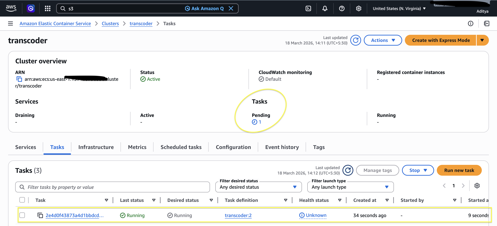
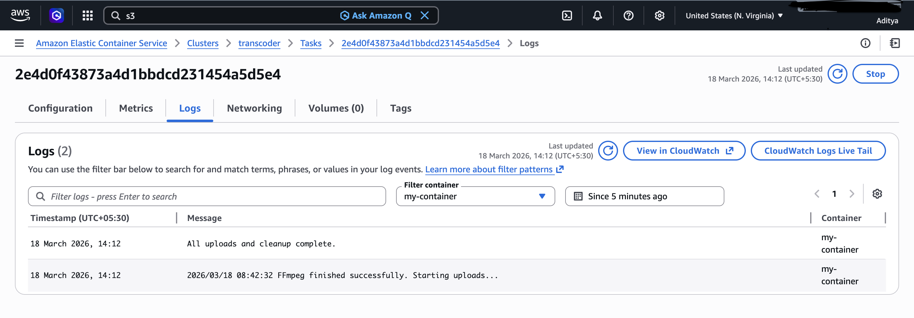
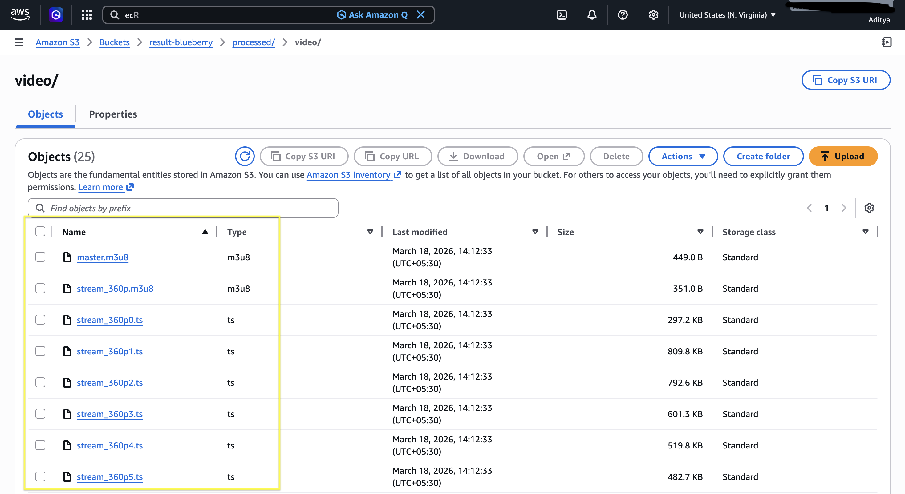
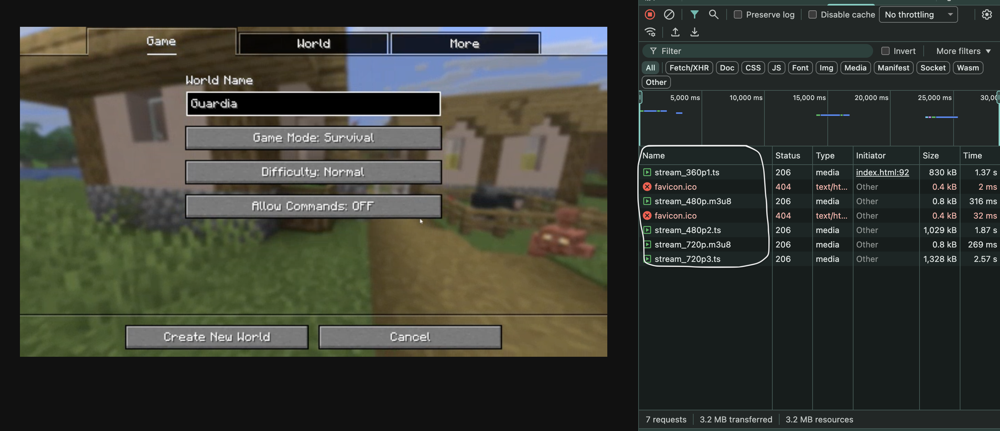

# Video Transcoder - Distributed Video Transcoding Pipeline

A high performance, event driven video transcoding engine built using **Golang**, **FFmpeg**, and **AWS**. This system automatically processes raw mp4 video uploads into adaptive HLS streams (360p, 480p, 720p) using a decoupled, serverless focused architecture.



## System Architecture

The pipeline follows a modern **Producer-Consumer** pattern to ensure high availability and cost-efficiency:

1.  **Trigger:** A `.mp4` file is uploaded to the **Input S3 Bucket**.
    

2.  **Messaging:** S3 triggers an event notification to **AWS SQS**.

3.  **Orchestration:** A Go based poller (running locally or on EC2) retrieves the message and triggers an **AWS ECS (Fargate)** task.
    

4.  **Processing:** The ECS container runs a Go worker that spawns three concurrent **Goroutines** to transcode the video into multiple resolutions using **FFmpeg**.
    
    
5.  **Delivery:** The worker generates an **HLS (.m3u8) Master Playlist** and segments (.ts), uploading them to the **Output S3 Bucket** for adaptive bitrate streaming.
    
    

---

## Key Features

- **Concurrency-First Design:** Leverages Go’s `sync.WaitGroup` and channels to transcode 360p, 480p, and 720p resolutions simultaneously, significantly reducing processing latency
- **Adaptive Bitrate Streaming (ABR):** Full support for the HLS protocol, allowing modern video players to switch quality dynamically based on user network conditions
- **Fault Tolerance:** Implements SQS visibility timeouts (30 min) and a "delete-on-success" logic to ensure 100% task completion and data integrity
- **Cost Optimization:** Uses ECS Fargate for Just in Time compute and SQS Long Polling (`WaitTimeSeconds: 20`) to minimize AWS API costs
- **Atomic S3 Operations:** Deletes the source file from the input bucket only after verified multi part uploads of all transcoded variants.

---

## Tech Stack

- **Language:** Go
- **Cloud:** AWS (S3, SQS, ECS, IAM, EC2)
- **Containerization:** Docker
- **Media Processing:** FFmpeg

---

## Local Setup

### Prerequisites

- Go installed
- AWS CLI configured with appropriate IAM permissions
- Docker

### Running the Poller

```bash
# Clone the repository
git clone https://github.com/blueberry-adii/video-transcoder.git

# Install dependencies
go mod tidy

# Run the SQS poller
go run cmd/main.go
```

## Containerization

```bash
# Build the docker image
docker build -t video-transcoder ./ecs-container
```
